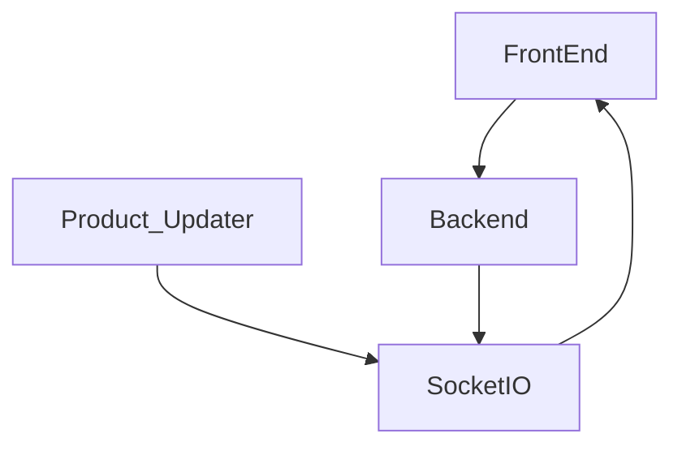

# Amazon Product Tracker

### Project Shema

---
### Features
- Rich search system 
    - graphic interpretation of SQL
    - presaved requests
    - quick search

- Tags and colors for each tag

- SocketIO allows to push all the changes to clients immediately

- Users and permissions by roles

- Each user can configure product columns, and choose from presaved config

